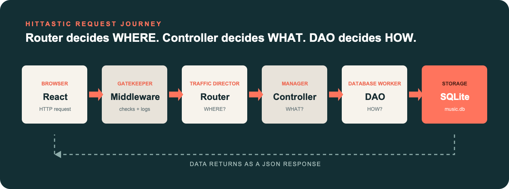
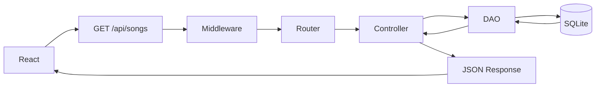

# QHO540 Web Application Development
## Week 9 Seminar: Routers, Controllers and DAOs with HitTastic

## 1. What are we learning?

HitTastic already works. This week we will refactor its backend into small parts with clear jobs. You will not build a server from nothing: each task starts from working code, points to one `TODO`, and gives you a small change you can run immediately.

Our memory rule is:



> **Router = Traffic Director** · **Controller = Manager / Decision Maker** · **DAO = Database Worker** · **Middleware = Gatekeeper** · **Database = Storage**

Most importantly:

> **Router decides WHERE. Controller decides WHAT. DAO decides HOW to talk to the database.**

## 2. Why `server.ts` becomes too large

A first Express application often puts routes, validation, SQL, login checks and error responses in one file. That is fine while it is tiny. As features grow, one change can affect unrelated code, repeated code appears, and finding the right line becomes slow.

Separation does not add new behaviour. It gives existing behaviour a sensible home.

## 3. Separation of concerns

Each layer has one main reason to change:

| Layer | Memory rule | Responsibility |
|---|---|---|
| Middleware | Gatekeeper | Run shared work before a route |
| Router | Traffic Director | Match and group URLs |
| Controller | Manager | Handle HTTP and decide the response |
| DAO | Database Worker | Run SQL and return data |
| `db.ts` | Storage connection | Share one SQLite connection |

This makes each file shorter, easier to test, and easier to discuss with a teammate.

## 4. What is a Router?

**Router = Traffic Director.** It matches URLs, groups related routes, and forwards a request to the correct controller.

For `GET /api/songs/artist/Oasis`:

1. `server.ts` sees `/api/songs`.
2. `songRouter` sees `/artist/:artist`.
3. The controller handles the request.

A router knows **where** the request goes. It should not contain SQL.

## 5. What is a Controller?

**Controller = Manager / Decision Maker.** It receives `request` and `response`, reads parameters or a body, validates the request, calls a DAO, selects the HTTP status, and returns JSON.

The controller knows HTTP. It should **not** contain SQL.

## 6. What is a DAO?

**DAO = Database Worker.** DAO means *Data Access Object*. It owns SQL, database queries and prepared statements, then returns plain data.

A DAO should not know about `request`, `response`, HTTP 404/401 statuses, or React. It knows **how** to talk to the database.

## 7. What is a shared `db.ts` module?

`db.ts` creates one shared database connection. Creating `new Database()` in the server, another router, and another controller is wasteful and makes configuration inconsistent.

The better path is:

```text
db.ts → exports one connection → DAO imports it
```

This starter also creates the `songs` table and seeds eight records the first time it launches.

## 8. What is modular middleware?

**Middleware = Gatekeeper.** It runs before the route/controller. A logger observes every request; authentication middleware can stop unauthorised requests.

Calling `next()` means **“Continue to the next middleware or route.”** If middleware sends a response instead, the journey stops there.

## 9. Full request journey



Open the browser developer tools and choose **Network → songs → Response**. The JSON returned by Express becomes the song cards rendered by React.

## 10. Project architecture

```text
React / Browser
      ↓ HTTP request
Express → Middleware → Router → Controller → DAO → SQLite
                                      ↑          ↓
React ← JSON response ← Controller ← data ──────┘
```

```text
src/
├── client/                 React interface
├── shared/Song.ts          Type shared by client and server
└── server/
    ├── server.ts           Creates and configures Express
    ├── db.ts               Opens and seeds one SQLite connection
    ├── routes/             Traffic Directors
    ├── controllers/        Managers / Decision Makers
    ├── dao/                Database Workers
    └── middleware/         Gatekeepers
```

> The supplied architecture PNG was not present in the workspace, so this repository includes a locally created equivalent at the required path. Replace it with the official supplied image if your tutor provides one.

## 11. Clone the project

```bash
git clone <repository-url>
cd qho540-week9-hittastic-architecture
npm install
```

## 12. Run the starter

```bash
npm run dev
```

Open <http://localhost:5173>. The API runs at <http://localhost:3000>. You should see song cards immediately. The React app includes safe fallback songs if the API is briefly unavailable.

Useful checks:

- <http://localhost:3000/api/health>
- <http://localhost:3000/api/songs>
- <http://localhost:3000/api/songs/artist/Oasis>

## 13. Tasks

Complete the tasks in order. After every small edit, save the file and observe the terminal or browser result.

### Task 1 — Trace one working request

Run the starter, open `src/client/App.tsx`, and find `fetch('/api/songs')`. Then trace the same request through:

1. `src/server/server.ts`
2. `src/server/routes/songRoutes.ts`
3. `src/server/controllers/SongController.ts`
4. `src/server/dao/SongDao.ts`
5. `src/server/db.ts`

Write each layer beside the matching box in the Mermaid diagram. No source change is needed yet.

### Task 2 — Inspect the shared database connection

Open `src/server/db.ts`. Find where the database path is created, where the `songs` table is created, and where the eight songs are seeded.

Why does `SongDao.ts` import `db` instead of calling `new Database()`? Discuss with a partner using the phrase **one shared connection**.

### Task 3 — Extract the logger gatekeeper

Open `src/server/middleware/logger.ts` and find `TODO Task 3`. Replace its `console.log` line with:

```ts
console.log(`[${new Date().toISOString()}] ${request.method} ${request.path}`);
```

Now open `src/server/server.ts`. Add this import at the TODO:

```ts
import { logger } from './middleware/logger.js';
```

Replace the whole inline starter logger block with:

```ts
app.use(logger);
```

Save, refresh the page, and watch the terminal. Every request now passes through a reusable **Gatekeeper**. `next()` allows it to continue.

### Task 4 — Let the router direct traffic

Open `src/server/routes/songRoutes.ts`. The routes currently use small wrapper functions. Replace the `GET /` route with:

```ts
songRouter.get('/', songController.getAll);
```

Replace the artist route with:

```ts
songRouter.get('/artist/:artist', songController.findByArtist);
```

The controller methods will be changed to arrow properties in Task 5 so they keep their `this` context if class state is later added.

Open `src/server/server.ts` and find:

```ts
app.use('/api/songs', songRouter);
```

This single mount groups every song route. Test `/api/songs` and `/api/songs/artist/Adele`. The router decides **WHERE**.

### Task 5 — Connect Controller and DAO clearly

Open `src/server/dao/SongDao.ts`. Replace `getAll` with:

```ts
getAll(): Song[] {
  const statement = db.prepare(`
    SELECT id, title, artist, price, quantity_in_stock
    FROM songs
    ORDER BY artist, title
  `);
  return statement.all() as Song[];
}
```

This is the only layer in the task containing SQL. The DAO decides **HOW** to talk to SQLite.

Next open `src/server/controllers/SongController.ts`. Replace `getAll` with:

```ts
getAll = (_request: Request, response: Response): void => {
  const songs = songDao.getAll();
  response.status(200).json(songs);
};
```

The controller knows that success means HTTP 200 and JSON; it does not know the SQL. The controller decides **WHAT** happens.

Refresh the catalogue. Its visible behaviour stays the same—that is a successful refactor.

### Task 6 — Search through every layer

In `src/server/dao/SongDao.ts`, replace `findByArtist` with:

```ts
findByArtist(artist: string): Song[] {
  const statement = db.prepare(`
    SELECT id, title, artist, price, quantity_in_stock
    FROM songs
    WHERE LOWER(artist) LIKE LOWER(@artist)
    ORDER BY title
  `);
  return statement.all({ artist: `%${artist}%` }) as Song[];
}
```

In `src/server/controllers/SongController.ts`, replace `findByArtist` with:

```ts
findByArtist = (request: Request, response: Response): void => {
  const artist = typeof request.params.artist === 'string'
    ? request.params.artist.trim()
    : '';
  if (!artist) {
    response.status(400).json({ message: 'Please provide an artist.' });
    return;
  }

  const songs = songDao.findByArtist(artist);
  response.status(200).json(songs);
};
```

Test <http://localhost:3000/api/songs/artist/oasis>. Identify which lines know HTTP and which know SQL.

### Task 7 — Make React use the artist route

The starter filters loaded songs in React so the UI works from the beginning. Now make a search travel through the full architecture.

In `src/client/App.tsx`, replace the existing `useEffect` and `visibleSongs` code with:

```ts
useEffect(() => {
  const timer = window.setTimeout(() => {
    const path = query.trim()
      ? `/api/songs/artist/${encodeURIComponent(query.trim())}`
      : '/api/songs';

    fetch(path)
      .then((response) => response.json() as Promise<Song[]>)
      .then((data) => {
        setSongs(data);
        setStatus(`${data.length} songs returned as JSON`);
      })
      .catch(() => setStatus('Could not reach the HitTastic API'));
  }, 300);

  return () => window.clearTimeout(timer);
}, [query]);

const visibleSongs = songs;
```

Remove `useMemo` from the React import because it is no longer used. Type `Oasis` into the UI, then inspect the request in the browser Network panel.

### Check your mental model

Complete these sentences without looking back:

- The Router decides which controller function should run for a given URL and HTTP method.
- The Controller decides what logic to perform and how to respond to the client.
- The DAO decides how to access, query, and modify the database to talk to the database.
- Middleware acts like a checkpoint or filter that runs before the controller.
- `db.ts` provides one shared database connection instance.

Answers: WHERE, WHAT, HOW, Gatekeeper, connection.

## Optional extension — Protect a route

`requireLogin.ts`, `userRoutes.ts`, `UserController.ts`, and `UserDao.ts` preserve a small Week 8-style login example. Add `requireLogin` before a route handler and send an `x-demo-user: student` header to pass the teaching gatekeeper. This is deliberately header-based for the architecture exercise; it is not production authentication.

## Troubleshooting

- If both ports are busy, stop older `npm run dev` processes and try again.
- If the UI shows fallback songs, check the API terminal and open `/api/health`.
- If TypeScript reports an unused import after Task 7, remove `useMemo`.
- Delete `data/music.db` only if you intentionally want the starter to recreate and reseed it on the next launch.

---

## NEW CONTENT: Simple explanation of the API in everyday words

This project is a small music app with a frontend and an API backend.

- The browser asks for songs using a URL like `/api/songs`.
- Express is the server that listens for those requests.
- A router decides which part of the app should handle the request.
- A controller decides what the request means and what response to send back.
- A DAO is the part that talks to the database and gets the real data.
- Middleware is like a helper that runs before the app handles the request, such as logging or login checks.

So in very simple terms:

- Router = where the request goes
- Controller = what happens next
- DAO = how the data is fetched
- Middleware = checks before the request continues

The app is split into small parts so it is easier to understand, fix, and grow later. This is the main learning idea of the API: each part has one job, and the request moves through the app in order.

Think of it like this:

1. The browser sends a request.
2. The router decides where it should go.
3. The controller decides what should happen.
4. The DAO asks the database for the data.
5. The server sends the result back as JSON.

That is the main idea behind this API: small pieces, clear jobs, and one request moving through each layer in order.
